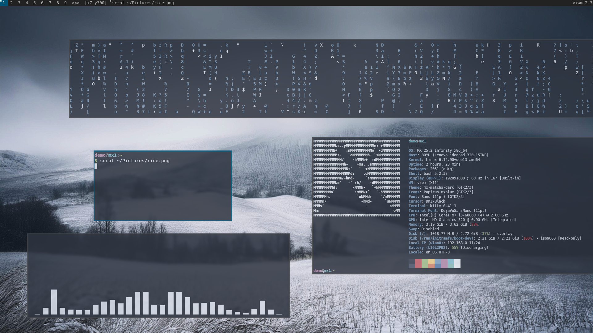

vxwm-dots
==
My dotfiles for VXWM.
For context, VXWM stands for Versatile X Window Manager. by versatile, I mean it supports master, tiling, stacking and infinite canvas. Known for being very lightweight btw.

> ⚠️ **Note:** The screenshot below is a old placeholder; i took this screenshot in a MX Linux Fluxbox live USB while i was trying out VXWM. The real  are way better!

## Dependencies:

picom (yshui fork) --- compositor

rofi --- app launcher

kitty --- terminal

scrot --- screenshot

feh --- wallpaper

etc.

## Compilation Dependencies
#### to compile yshui's picom and vxwm.
since this project was built around MX Linux, the commands are mostly apt. We will add support for more distros later.

`sudo apt update`

`sudo apt install meson ninja-build libxext-dev libxcb1-dev \
libxcb-damage0-dev libxcb-xfixes0-dev libxcb-shape0-dev \
libxcb-render-util0-dev libxcb-render0-dev libxcb-randr0-dev \
libxcb-composite0-dev libxcb-image0-dev libxcb-present-dev \
libxcb-xinerama0-dev libxcb-glx0-dev libpixman-1-dev \
libdbus-1-dev libconfig-dev libgl1-mesa-dev libpcre2-dev \
libev-dev libuthash-dev libepoxy-dev libx11-xcb-dev \
libxcb-util-dev libxcb-keysyms1-dev libxcb-ewmh-dev \
libxcb-icccm4-dev -y`

## toys
#### things like fastfetch, cmatrix...
cava

fastfetch

cmatrix

tte

starship (not pre-configured)

cowsay
